# 【笔记】Sturctured Streaming笔记总结（Python版）


# **目录**
- [2024-06-01-【笔记】Sturctured Streaming笔记总结（Python版）.md](#2024-06-01-笔记sturctured-streaming笔记总结python版md)
- [**目录**](#目录)
- [相关资料](#相关资料)
  - [本文相关代码](#本文相关代码)
- [一、概述](#一概述)
  - [1.1 基本概念](#11-基本概念)
  - [1.2 两种处理模型](#12-两种处理模型)
    - [（1）微批处理](#1微批处理)
    - [（2）持续处理](#2持续处理)
  - [1.3 Structured Streaming和Spark SQL、Spark Streaming关系](#13-structured-streaming和spark-sqlspark-streaming关系)
- [二、编写Structured Streaming程序的基本步骤](#二编写structured-streaming程序的基本步骤)
- [三、输入源](#三输入源)
  - [3.1 File源](#31-file源)
    - [（1）创建程序生成JSON格式的File源测试数据](#1创建程序生成json格式的file源测试数据)
    - [（2）创建程序对数据进行统计](#2创建程序对数据进行统计)
    - [（3）测试运行程序](#3测试运行程序)
    - [（4）处理警告](#4处理警告)
    - [（5）总结分析](#5总结分析)
  - [3.2 Kafka源](#32-kafka源)
    - [（1）启动Kafka](#1启动kafka)
    - [（2）编写生产者（Producer）程序](#2编写生产者producer程序)
    - [（3）安装Python3的Kafka支持](#3安装python3的kafka支持)
    - [（4）运行生产者程序](#4运行生产者程序)
    - [（5）编写并运行消费者（Consumer）程序](#5编写并运行消费者consumer程序)
      - [方式一](#方式一)
      - [方式二](#方式二)
    - [总结](#总结)
  - [3.3 Socket源](#33-socket源)
  - [3.4 Rate源](#34-rate源)
------


# 相关资料

1. [厦大 Kafka和Structured Streaming的组合使用（Scala版）](https://dblab.xmu.edu.cn/blog/3160/)

2. [Structured Streaming + Kafka集指南](https://spark.apache.org/docs/3.2.0/structured-streaming-kafka-integration.html)

3. [Pyspark手册DataStreamReader](https://spark.apache.org/docs/3.2.0/api/python/reference/api/pyspark.sql.streaming.DataStreamReader.html#pyspark.sql.streaming.DataStreamReader)

4. [Kafka安装教程](https://blog.csdn.net/qq_67822268/article/details/138626412)

5. [Maven中央仓库](https://repo1.maven.org/maven2/)

6. [Maven Repository](https://mvnrepository.com/)

7. [kafka-python文档](https://kafka-python.readthedocs.io/en/master/index.html)

8. [strcuted streaming OutputMode讲解](https://www.jianshu.com/p/ed1398c2470a))

------

## 本文相关代码

本文相关代码读者可以自行下载：

链接：https://pan.baidu.com/s/121zVsgc4muSt9rgCWnJZmw

提取码：wkk6

------

# 一、概述

## 1.1 基本概念

Structured Streaming 是 Apache Spark 提供的一种流处理引擎，它基于 Spark SQL 引擎，并提供了更高级别、更易用的 API，使得处理实时数据流变得更加简单和直观。

 Structured Streaming 的一些特点和优势：

1. **基于 DataFrame 和 Dataset API**：Structured Streaming 构建在 Spark 的 DataFrame 和 Dataset API 之上，使得对流数据的处理与批处理非常类似，降低了学习成本。
2. **容错性**：Structured Streaming 提供端到端的容错保证（指在分布式系统中，整个数据处理流程从数据输入到输出的全过程都能够保证容错性。换句话说，无论是数据的接收、处理还是输出，系统都能够在发生故障或异常情况时保持数据的完整性和一致性），能够确保在发生故障时不会丢失数据，并且能够保证精确一次处理语义。
3. **高性能**：Structured Streaming 充分利用了 Spark 引擎的优化能力，能够进行查询优化、状态管理和分布式处理，从而提供高性能的实时处理能力。
4. **灵活的事件时间处理**：Structured Streaming 支持事件时间（event-time）处理，可以轻松处理乱序事件、延迟事件等场景，并提供丰富的窗口操作支持。
5. **集成性**：Structured Streaming 提供了与各种数据源的集成，包括 Kafka、Flume、HDFS、S3 等，同时也支持将结果写入各种存储系统。
6. **易于调试和监控**：Structured Streaming 提供了丰富的监控和调试功能，包括进度报告、状态查询等，方便用户监控作业的执行情况。

Structured Streaming的关键思想是将实时数据流视为一张正在不断添加数据的表

可以把流计算等同于在一个静态表上的批处理查询，Spark会在不断添加数据的<font color=red>无界输入表</font>上运行计算，并进行增量查询


在无界表上对输入的查询将生成结果表，系统每隔一定的周期会触发对<font color=red>无界表</font>的计算并更新结果表


## 1.2 两种处理模型

### （1）微批处理

Structured Streaming<font color=red>默认</font>使用微批处理执行模型，这意味着Spark流计算引擎会定期检查流数据源，并对自上一批次结束后到达的<font color=red>新数据</font>执行批量查询

数据到达和得到处理并输出结果之间的延时<font color=＃00FFFF>超过100毫秒</font>

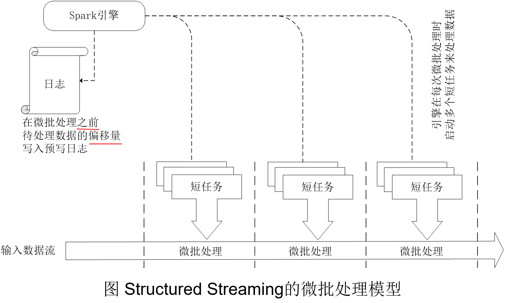

在这里，回答三个问题：

1.什么是偏移量？

在 Structured Streaming 中，偏移量（Offset）是指用于标识数据流中位置的标记，它表示了数据流中的一个特定位置或者偏移量。在流处理中，偏移量通常用于记录已经处理的数据位置，以便在失败恢复、断点续传或者状态管理等场景下能够准确地从中断处继续处理数据。

具体来说，在结构化流处理中，偏移量通常与输入数据源紧密相关，比如 Kafka、File Source 等。当 Spark 结构化流启动时，会从数据源中读取偏移量，并使用这些偏移量来确定应该从哪里开始读取数据。随着数据被处理，Spark 会不断更新偏移量，以确保在发生故障或重启情况下能够准确地恢复到之前处理的位置。

2.为什么要记录偏移量？

- **容错和故障恢复**：记录偏移量可以确保在流处理过程中发生故障或者需要重启时能够准确地恢复到之前处理的位置，避免数据的丢失和重复处理。通过记录偏移量，流处理系统能够知道从哪里继续读取数据，从而保证数据处理的完整性和一致性。
- **精确一次处理语义**：记录偏移量也有助于实现精确一次处理语义，即确保每条输入数据只被处理一次。通过准确记录偏移量并在发生故障后能够准确地恢复到之前的位置，流处理系统能够避免重复处理数据，从而确保处理结果的准确性。
- **断点续传**：记录偏移量还使得流处理系统能够支持断点续传的功能，即在流处理过程中可以随时停止，并在之后恢复到之前的处理位置，而不需要重新处理之前已经处理过的数据。

通过记录偏移量，结构化流处理可以实现精确一次处理语义，并确保即使在出现故障和重启的情况下也能够保证数据不会被重复处理或丢失。因此，偏移量在结构化流处理中扮演着非常重要的角色，是实现流处理的容错性和准确性的关键之一。

关于偏移量的理解，可以参考：[关于偏移量的理解-CSDN博客](https://blog.csdn.net/u011641620/article/details/15963851)

3.为什么延时超过100毫秒？

Driver 驱动程序通过将当前待处理数据的偏移量<font color=red>保存到预写日志</font>中，来对数据处理进度设置检查点，以便今后可以使用它来重新启动或恢复查询。

为了获得确定性的重新执行（Deterministic Re-executions）和端到端语义，在下一个微批处理之前，就要将该微批处理所要处理的数据的偏移范围保存到日志中。所以，当前到达的数据需要等待先前的微批作业处理完成，<font color=red>且</font>它的偏移量范围被记入日志后，才能在下一个微批作业中得到处理，这会导致数据到达和得到处理并输出结果之间的延时超过100毫秒。

### （2）持续处理

微批处理的数据延迟对于大多数实际的流式工作负载（如ETL和监控）已经足够了，然而，一些场景确实需要<font color=red>更低的延迟</font>。比如，在金融行业的信用卡欺诈交易识别中，需要在犯罪分子盗刷信用卡后立刻识别并阻止，但是又不想让合法交易的用户感觉到延迟，从而影响用户的使用体验，这就需要在 10～20毫秒的时间内对每笔交易进行欺诈识别，这时就不能使用微批处理模型，而需要使用持续处理模型。


Spark从2.3.0版本开始引入了持续处理的试验性功能，可以实现流计算的毫秒级延迟。

在持续处理模式下，Spark不再根据触发器来周期性启动任务，而是启动一系列的连续读取、处理和写入结果的长时间运行的任务。


为了缩短延迟，引入了新的算法对查询设置检查点，在每个任务的输入数据流中，一个特殊标记的记录被注入。当任务遇到标记时，任务把处理后的最后偏移量[异步](https://www.bilibili.com/video/BV1MC411a7rY/?share_source=copy_web&vd_source=4e01e9db7e3603b44b8d2cfb31455773)（任务的执行不必等待其他任务完成或某个事件发生）地报告给引擎，引擎接收到所有写入接收器的任务的偏移量后，写入预写日志。由于检查点的写入是完全异步的，任务可以持续处理，因此，延迟可以缩短到毫秒级。也正是由于写入是异步的，会导致数据流在故障后可能被处理超过一次以上，所以，持续处理只能做到“至少一次”的一致性。因此，需要注意到，虽然持续处理模型能比微批处理模型获得更好的实时响应性能，但是，这是以牺牲一致性为代价的。微批处理可以保证端到端的完全一致性，而持续处理只能做到“至少一次”的一致性。


微批处理和持续处理是流处理中两种常见的处理模式，将他们进行对比：

1. **处理方式**：
   - 微批处理（micro-batch processing）：将连续的数据流按照一定的时间间隔或者数据量划分成小批量进行处理，每个批量数据被视为一个微批作业，类似于批处理的方式进行处理。
   - 持续处理（continuous processing）：对不间断的数据流进行实时处理，没有明确的批次边界，数据到达后立即进行处理和输出。
2. **延迟和实时性**：
   - 微批处理通常会导致一定的延迟，因为数据需要等待下一个批次的处理才能输出结果，因此微批处理一般无法做到完全的实时性。
   - 持续处理具有更好的实时性，因为数据到达后立即进行处理，可以更快地输出结果。
3. **容错和状态管理**：
   - 微批处理通常通过检查点机制来实现容错和状态管理，每个微批作业之间会保存处理状态，以便故障恢复和重新执行。
   - 持续处理也需要考虑容错和状态管理，但通常需要使用更复杂的机制来实现实时的状态管理和故障恢复。
4. **资源利用**：
   - 微批处理可以更好地利用批处理系统的资源，因为可以对数据进行分批处理，适用于一些需要大批量数据一起处理的场景。
   - 持续处理需要更多的实时资源和更高的实时性能，适用于对数据要求实时性较高的场景。

## 1.3 Structured Streaming和Spark SQL、Spark Streaming关系

- Structured Streaming处理的数据跟Spark Streaming一样，也是源源不断的数据流，区别在于，<font color=gree>Spark Streaming</font>采用的数据抽象是<font color=gree>DStream</font>（本质上就是一系列RDD），而<font color=green>Structured Streaming</font>采用的数据抽象是<font color=green>DataFrame</font>。
- Structured Streaming可以使用Spark SQL的DataFrame/Dataset来处理数据流。虽然Spark SQL也是采用DataFrame作为数据抽象，但是，Spark SQL只能处理静态的数据，而Structured Streaming可以处理结构化的数据流。这样，Structured Streaming就将Spark SQL和Spark Streaming二者的特性结合了起来。
- Structured Streaming可以对DataFrame/Dataset应用各种操作，包括select、where、groupBy、map、filter、flatMap等。
- Spark Streaming只能实现秒级的实时响应，而Structured Streaming由于采用了全新的设计方式，采用微批处理模型时可以实现100毫秒级别的实时响应，采用持续处理模型时可以支持毫秒级的实时响应。

# 二、编写Structured Streaming程序的基本步骤

编写Structured Streaming程序的基本步骤包括：

- 导入pyspark模块
- 创建SparkSession对象
- 创建输入数据源
- 定义流计算过程
- 启动流计算并输出结果

实例任务：一个包含很多行英文语句的数据流源源不断到达，Structured Streaming程序对每行英文语句进行拆分，并统计每个单词出现的频率

在/home/hadoop/sparksj/mycode/structured目录下创建StructuredNetworkWordCount.py文件：

```python
# 导入必要的 SparkSession 和函数库
from pyspark.sql import SparkSession
from pyspark.sql.functions import split
from pyspark.sql.functions import explode

# 程序的入口点，判断是否在主程序中执行
if __name__ == "__main__":
    # 创建 SparkSession 对象，设置应用程序名字为 "StructuredNetworkWordCount"
    spark = SparkSession \
        .builder \
        .appName("StructuredNetworkWordCount") \
        .getOrCreate()
    
    # 设置 Spark 日志级别为 WARN，减少日志输出
    spark.sparkContext.setLogLevel('WARN')
    
    # 从指定的主机（localhost）和端口（9999）读取数据流，使用 "socket" 格式
    lines = spark \
        .readStream \
        .format("socket") \
        .option("host", "localhost") \
        .option("port", 9999) \
        .load()
    
    # 将每行数据按空格分割成单词，并使用 explode 函数将单词展开成行
    words = lines.select(explode(split(lines.value, " ")).alias("word"))
    
    # 对单词进行分组计数
    wordCounts = words.groupBy("word").count()
    
    # 将结果写入到控制台，输出模式为 "complete"，每8秒触发一次流处理
    query = wordCounts \
        .writeStream \
        .outputMode("complete") \
        .format("console") \
        .trigger(processingTime="8 seconds") \
        .start()
    
    # 等待流查询终止
    query.awaitTermination()
```

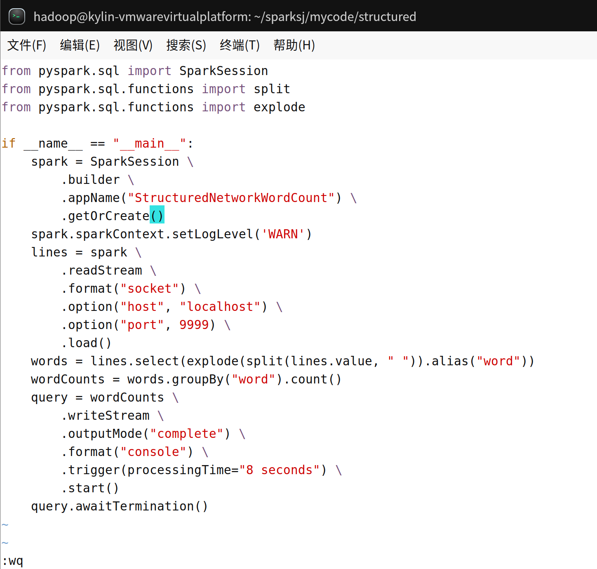

在执行StructuredNetworkWordCount.py之前，需要启动HDFS：

```bash
start-dfs.sh
```


新建一个终端（记作“数据源终端”），输入如下命令：

```bash
nc -lk 9999
```

再新建一个终端（记作“流计算终端”），执行如下命令：

```bash
cd /home/hadoop/sparksj/mycode/structured
spark-submit StructuredNetworkWordCount.py
```

执行程序后，在“数据源终端”内用键盘不断敲入一行行英文语句，nc程序会把这些数据发送给StructuredNetworkWordCount.py程序进行处理：

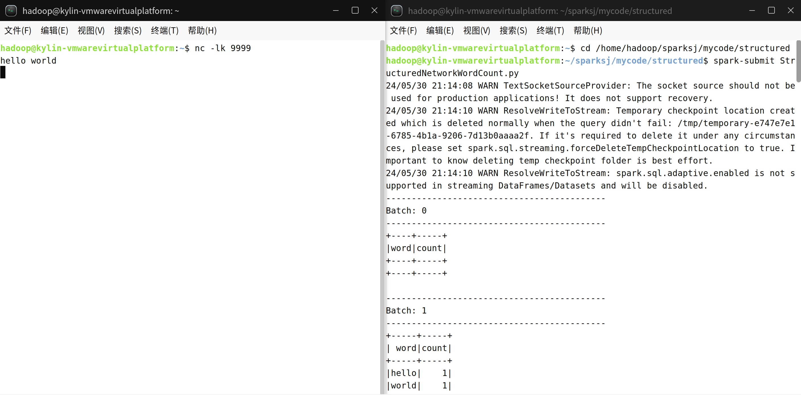

输出结果内的Batch后面的数字，说明这是第几个微批处理，系统每隔8秒会启动一次微批处理并输出数据。如果要停止程序的运行，则可以在终端内键入“<font color=red>**Ctrl+C**</font>”来停止。

# 三、输入源

## 3.1 File源

File源（或称为“文件源”）以文件流的形式读取某个目录中的文件，支持的文件格式为csv、json、orc、parquet、text等。

需要注意的是，文件放置到给定目录的操作应当是原子性的，即不能长时间在给定目录内打开文件写入内容，而是应当采取大部分操作系统都支持的、通过写入到临时文件后移动文件到给定目录的方式来完成。

File 源的[选项](https://spark.apache.org/docs/3.2.0/sql-data-sources.html)（option）主要包括如下几个：

- path：输入路径的目录，所有文件格式通用。path 支持glob 通配符路径，但是目录或glob通配符路径的格式不支持以多个逗号分隔的形式。
- maxFilesPerTrigger：每个触发器中要处理的最大新文件数（默认无最大值）。
- latestFirst：是否优先处理最新的文件，当有大量文件积压时，设置为True可以优先处理新文件，默认为False。
- fileNameOnly：是否仅根据文件名而不是完整路径来检查新文件，默认为False。如果设置为True，则以下文件将被视为相同的文件，因为它们的文件名“dataset.txt”相同：

> "file:///dataset.txt"
>
> "s3://a/dataset.txt"
>
> "s3n://a/b/dataset.txt"
>
> "s3a://a/b/c/dataset.txt"

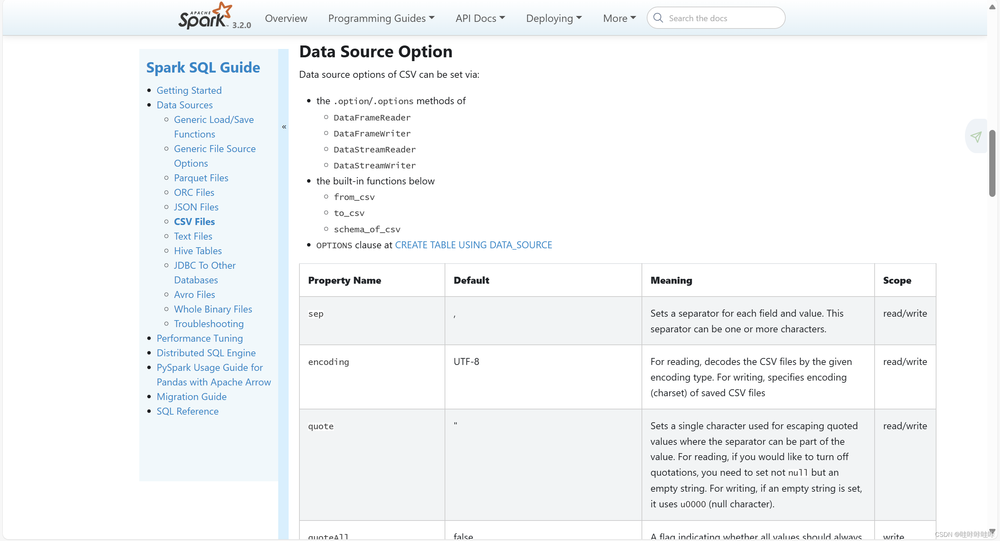

特定的文件格式也有一些其他特定的选项，具体可以参阅[Spark手册](https://spark.apache.org/docs/3.2.0/index.html)内[DataStreamReader](https://spark.apache.org/docs/3.2.0/api/python/reference/api/pyspark.sql.streaming.DataStreamReader.html#pyspark.sql.streaming.DataStreamReader)中的相关说明：

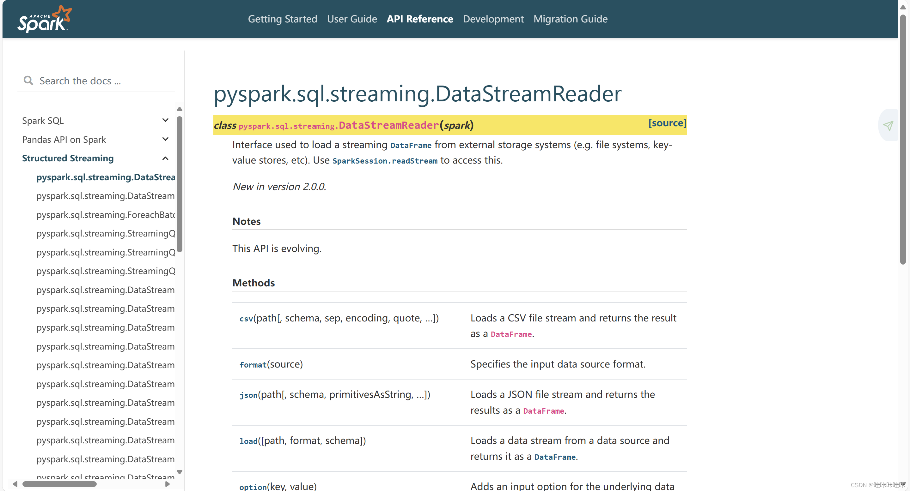

以.csv文件源为例，以下为示例代码：

```python
csvDF = spark \
    .readStream \
    .format("csv") \
    .option("seq",";") \
    .load("SOME_DIR")
```

其中，seq选项指定了.csv的间隔符号。

**实例：**

以一个JSON格式文件的处理来演示File源的使用方法，主要包括以下两个步骤：

- 创建程序生成JSON格式的File源测试数据
- 创建程序对数据进行统计

### （1）创建程序生成JSON格式的File源测试数据

生成模拟的电商购买行为数据，并将数据保存为 JSON 文件。模拟了用户的登录、登出和购买行为，包括事件发生的时间戳、动作类型和地区等信息

在/home/hadoop/sparksj/mycode/structured目录下创建a.py文件：

```python
import os                  # 导入 os 模块，用于处理文件和目录路径
import shutil              # 导入 shutil 模块，用于文件操作，比如移动文件
import random              # 导入 random 模块，用于生成随机数
import time                # 导入 time 模块，用于获取时间戳

# 定义测试数据存储的临时目录和最终目录
TEST_DATA_TEMP_DIR = '/tmp/'    # 临时目录，用于生成文件
TEST_DATA_DIR = '/tmp/testdata/'  # 最终目录，存储生成的文件

# 定义可能的行为和地区
ACTION_DEF = ['login', 'logout', 'purchase']  # 可能的行为
DISTRICT_DEF = ['fujian', 'beijing', 'shanghai', 'guangzhou']  # 可能的地区

# JSON 行的模板，包含时间、行为和地区
JSON_LINE_PATTERN = '{"eventTime": "{}", "action": "{}", "district": "{}"}\n'

# 设置测试环境，清空最终目录
def test_setUp():
    if os.path.exists(TEST_DATA_DIR):       # 检查最终目录是否存在
        shutil.rmtree(TEST_DATA_DIR, ignore_errors=True)  # 如果存在，递归删除目录及其内容
    os.mkdir(TEST_DATA_DIR)                  # 创建最终目录

# 清理测试环境，删除最终目录及其内容
def test_tearDown():
    if os.path.exists(TEST_DATA_DIR):       # 检查最终目录是否存在
        shutil.rmtree(TEST_DATA_DIR, ignore_errors=True)  # 如果存在，递归删除目录及其内容

# 写入文件并移动到最终目录
def write_and_move(filename, data):
    with open(TEST_DATA_TEMP_DIR + filename,"wt", encoding="utf-8") as f:  # 打开临时目录下的文件并写入数据
        f.write(data)                                                     # 写入数据到文件

    shutil.move(TEST_DATA_TEMP_DIR + filename, TEST_DATA_DIR + filename)   # 将文件移动到最终目录

# 主程序
if __name__ == "__main__":    # 程序的入口，如果作为脚本直接执行，则会执行下面的代码
    test_setUp()               # 设置测试环境，清空最终目录

    # 生成模拟数据，循环生成100个文件
    for i in range(100):
        filename = 'e-mall-{}.json'.format(i)    # 生成文件名，格式为 e-mall-i.json

        content = ''                              # 初始化内容为空字符串
        rndcount = list(range(10))                # 生成一个包含0到9的列表
        random.shuffle(rndcount)                  # 打乱列表顺序，随机生成行数
        for _ in rndcount:                        # 遍历每一个随机数
            content += JSON_LINE_PATTERN.format(  # 根据模板生成一行 JSON 数据
                str(int(time.time())),            # 时间戳，当前时间的秒数，转换为字符串
                random.choice(ACTION_DEF),        # 随机选择行为
                random.choice(DISTRICT_DEF))      # 随机选择地区
        write_and_move(filename, content)         # 调用函数写入数据到文件并移动到最终目录

        time.sleep(1)                             # 休眠1秒，模拟数据生成间隔

    test_tearDown()                              # 清理测试环境，删除最终目录及其内容
```

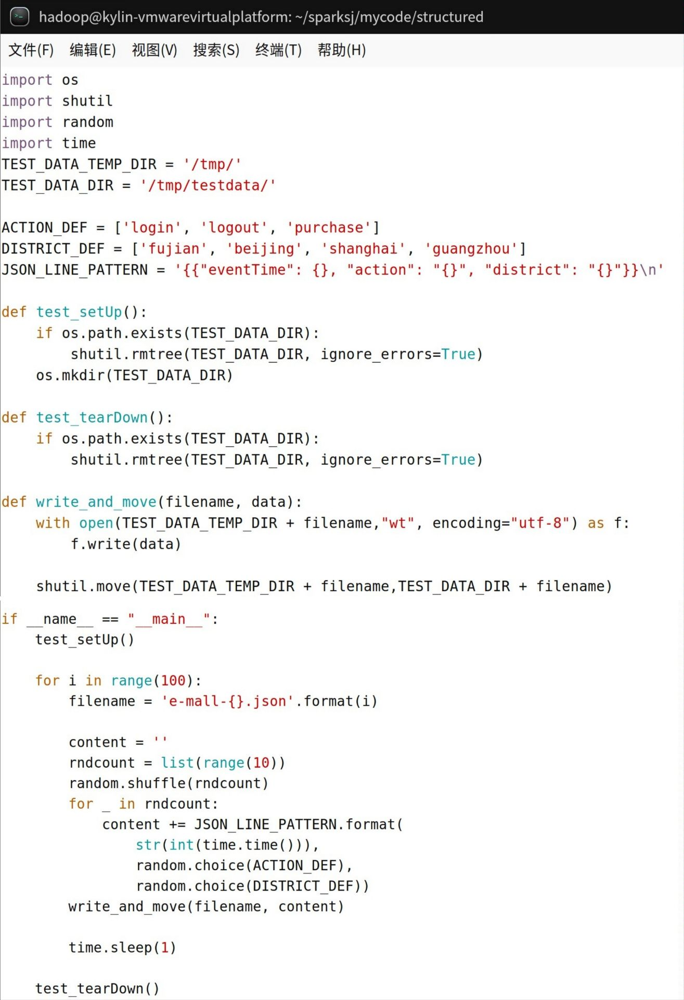

这段程序首先建立测试环境，清空测试数据所在的目录，接着使用for循环一千次来生成一千个文件，文件名为“e-mall-数字.json”， 文件内容是不超过100行的随机JSON行，行的格式是类似如下：

> {"eventTime": 1546939167, "action": "logout", "district": "fujian"}\n

其中，时间、操作和省与地区均随机生成。测试数据是模拟电子商城记录用户的行为，可能是登录、退出或者购买，并记录了用户所在的省与地区。为了让程序运行一段时间，每生成一个文件后休眠1秒。在临时目录内生成的文件，通过移动（move）的<font color=red>原子操作</font>移动到测试目录。

### （2）创建程序对数据进行统计

同样，在/home/hadoop/sparksj/mycode/structured目录下创建b.py文件：

```python
import os                              # 导入 os 模块，用于处理文件和目录路径
import shutil                          # 导入 shutil 模块，用于文件操作，比如移动文件
from pprint import pprint             # 导入 pprint 模块，用于漂亮地打印数据结构

from pyspark.sql import SparkSession  # 从 PySpark 中导入 SparkSession，用于创建 Spark 应用程序
from pyspark.sql.functions import window, asc  # 从 PySpark 中导入窗口函数和升序排序函数
from pyspark.sql.types import StructType, StructField, TimestampType, StringType  # 从 PySpark 中导入结构类型和时间戳类型、字符串类型

TEST_DATA_DIR_SPARK = 'file:///tmp/testdata/'  # 测试数据存储的目录，使用 file:/// 开头表示本地文件系统路径

if __name__ == "__main__":  # 程序入口，如果作为脚本直接执行，则执行下面的代码

    # 定义模拟数据的结构
    schema = StructType([
        StructField("eventTime", TimestampType(), True),  # 定义事件时间字段，类型为时间戳
        StructField("action", StringType(), True),        # 定义行为字段，类型为字符串
        StructField("district", StringType(), True)])     # 定义地区字段，类型为字符串

    # 创建 SparkSession，如果已存在则获取，否则创建一个新的
    spark = SparkSession \
        .builder \
        .appName("StructuredEMallPurchaseCount") \  # 设置应用程序名称
        .getOrCreate()

    spark.sparkContext.setLogLevel('WARN')  # 设置日志级别为 WARN，以减少不必要的日志输出

    # 从文件流中读取 JSON 数据，应用指定的模式
    lines = spark \
        .readStream \
        .format("json") \
        .schema(schema) \
        .option("maxFilesPerTrigger", 100) \  # 每次触发处理的最大文件数，以控制处理速度
        .load(TEST_DATA_DIR_SPARK)

    windowDuration = '1 minutes'  # 定义时间窗口的持续时间

    # 对购买行为进行筛选、按地区和时间窗口进行分组统计购买次数，并按时间窗口排序
    windowedCounts = lines \
        .filter("action = 'purchase'") \
        .groupBy('district', window('eventTime', windowDuration)) \
        .count() \
        .sort(asc('window'))

    # 将结果写入控制台
    query = windowedCounts \
        .writeStream \
        .outputMode("complete") \
        .format("console") \
        .option('truncate', 'false') \  # 控制台输出不截断
        .trigger(processingTime="10 seconds") \  # 触发处理的时间间隔
        .start()

    query.awaitTermination()  # 等待查询终止
```

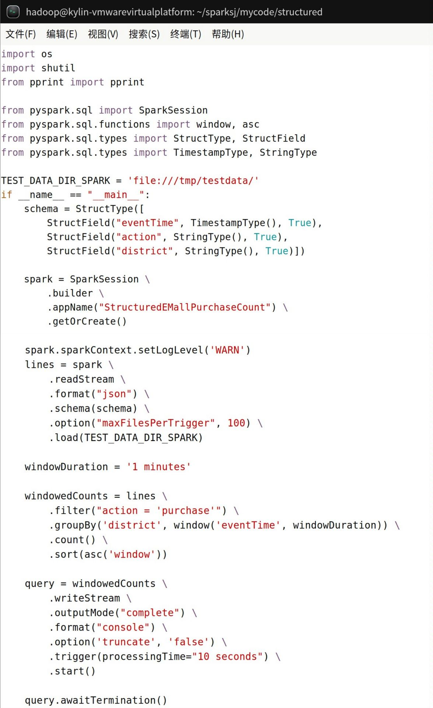

该程序的目的是过滤用户在电子商城里的购买记录，并根据省与地区以1分钟的时间窗口统计各个省与地区的购买量，并按时间排序后输出。

### （3）测试运行程序

程序运行过程需要访问HDFS，因此，需要启动HDFS：

```bash
start-dfs.sh
```

新建一个终端，执行如下命令生成测试数据：

```bash
cd /home/hadoop/sparksj/mycode/structured
python3 a.py
```

再次新建一个终端，执行如下命令运行数据统计程序：

```bash
cd /home/hadoop/sparksj/mycode/structured
spark-submit b.py
```

运行程序以后，可以看到类似如下的输出结果：

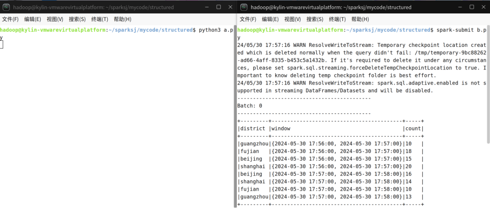

### （4）处理警告

如果运行过程中出现警告可忽略，<font color=red>不影响正常运行</font>：

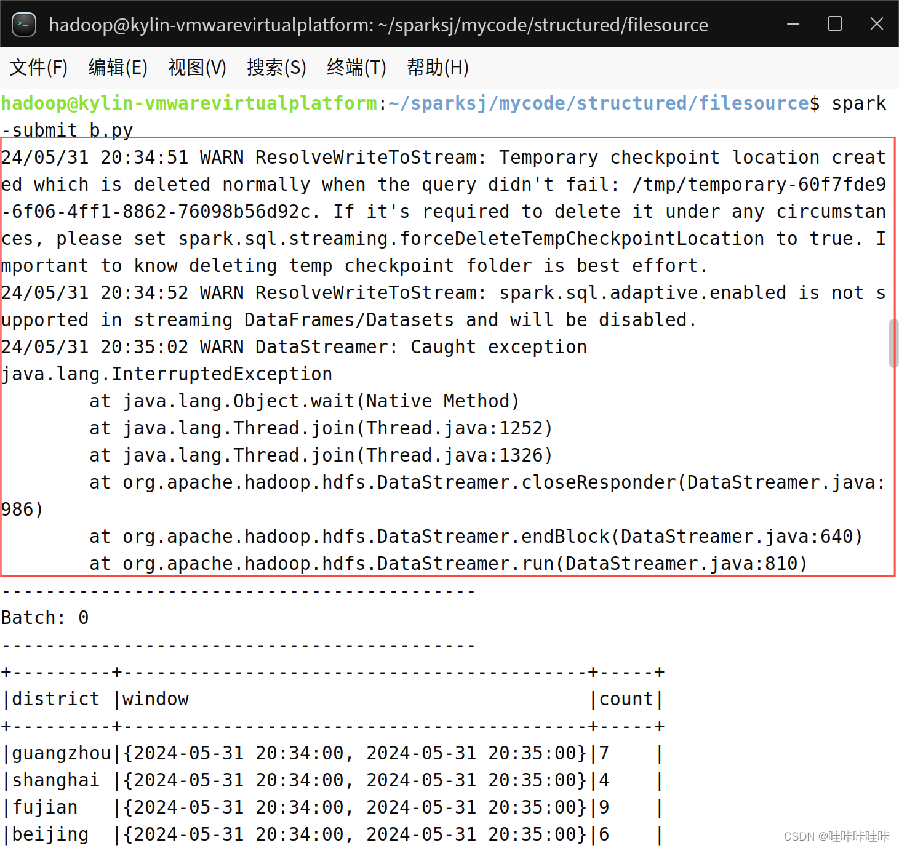

------

运行过程中出现如下警告，当然也<font color=red>不影响运行</font>，也可以进行解决：


意思就是处理时间触发器的批处理已经开始滞后。具体来说，当前批处理花费的时间超过了触发器设定的时间间隔

上述代码中触发器的间隔被设置为 10000 毫秒（也就是10秒），但是当前批处理花费了16341毫秒，远远超过了设定的时间间隔

可能会导致：

1. **处理延迟**: 当批处理花费的时间超过触发器设定的时间间隔时，可能会导致处理延迟，因为下一个批处理可能无法按时启动。
2. **资源利用不佳**: 如果批处理持续花费较长时间，可能会导致资源（如CPU、内存等）的浪费，因为资源被用于等待而不是实际的处理任务。

上述警告可通过修改b.py代码中'<font color=gree>processingTime</font>'的值，将它改成大于上图中的16341ms即可（1秒=1000毫秒）

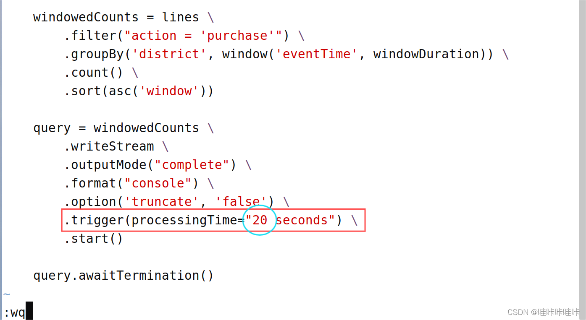

------

当然，若读者厌烦于这些警告，也可与选择<font color=red>设置</font> Apache Spark 的<font color=red>日志级别为 ERROR</font>，只记录 ERROR 级别及以上的日志信息

将b.py代码中的spark.sparkContext.setLogLevel('WARN')改为spark.sparkContext.setLogLevel('ERROR')即可：


保存并再次运行可得到干净整洁的结果：

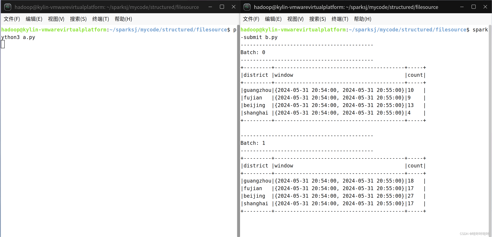

### （5）总结分析

a.py是一个 Python 脚本，用于生成模拟的电商购买行为数据，并将数据保存为 JSON 文件。它模拟了用户的登录、登出和购买行为，包括事件发生的时间戳、动作类型和地区等信息。

b.py是一个 PySpark Structured Streaming 应用程序，用于实时处理模拟的电商购买行为数据。它从指定的目录（即a.py生成的 JSON 文件目录）读取数据，并进行实时统计，计算每个地区在一分钟内的购买次数，并按时间窗口排序，然后将结果输出到控制台。

<font color=red>**联系：**</font>a.py生成的模拟购买行为数据是b.py的输入数据源。a.py生成的 JSON 文件包含了购买行为的模拟数据，而b.py则通过 Spark Structured Streaming 读取这些 JSON 文件，并实时处理统计购买行为数据，最终将结果输出到控制台。

如果你先执行a.py，生成了购买行为的模拟数据，然后再执行b.py，它将会从a.py生成的目录中读取数据，并进行实时统计购买行为数据。这样，你就可以通过实时监控控制台输出，了解每个地区在一分钟内的购买情况，从而进行实时的业务分析或监控。

## 3.2 Kafka源

[Kafka](https://blog.csdn.net/qq_67822268/article/details/138626412) 源的[选项](https://spark.apache.org/docs/3.2.0/structured-streaming-kafka-integration.html#creating-a-kafka-source-for-batch-queries)（option）包括如下几个:

- assign：指定所消费的Kafka主题和分区。
- subscribe：订阅的Kafka主题，为逗号分隔的主题列表。
- subscribePattern：订阅的Kafka主题正则表达式，可匹配多个主题。
- kafka.bootstrap.servers：Kafka服务器的列表，逗号分隔的“host：port”列表。
- startingOffsets：起始位置偏移量。
- endingOffsets：结束位置偏移量。
- failOnDataLoss：布尔值，表示是否在Kafka 数据可能丢失时（主题被删除或位置偏移量超出范围等）触发流计算失败。一般应当禁止，以免误报。

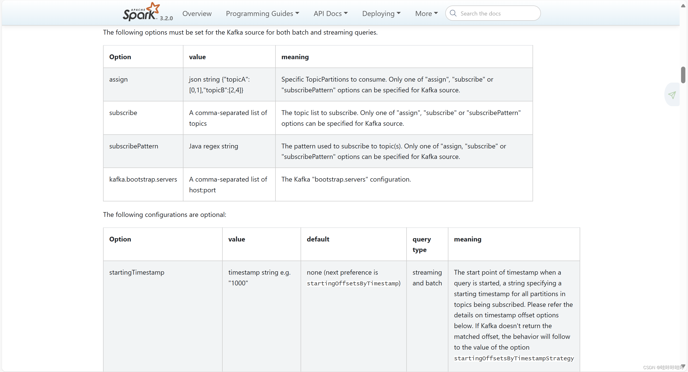

实例：使用生产者程序每0.1秒生成一个包含2个字母的单词，并写入Kafka的名称为“wordcount-topic”的主题（Topic）内。Spark的消费者程序通过订阅wordcount-topic，会源源不断收到单词，并且每隔8秒钟对收到的单词进行一次词频统计，把统计结果输出到Kafka的主题wordcount-result-topic内，同时，通过2个监控程序检查Spark处理的输入和输出结果。

### （1）启动Kafka

新建一个终端（记作“Zookeeper终端”），输入下面命令启动Zookeeper服务（<font color=red>不要关闭</font>这个终端窗口，一旦关闭，Zookeeper服务就停止了）：

```bash
cd /usr/local/kafka
./bin/zookeeper-server-start.sh config/zookeeper.properties
```

另外打开第二个终端（记作“Kafka终端”），然后输入下面命令启动Kafka服务（<font color=red>不要关闭</font>这个终端窗口，一旦关闭，Kafka服务就停止了）：

```bash
cd /usr/local/kafka
./bin/kafka-server-start.sh config/server.properties
```

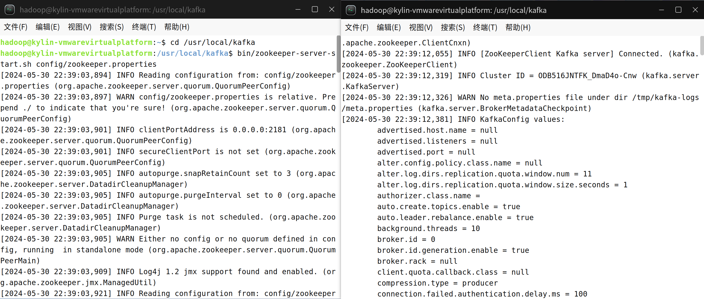

再新开一个终端（记作“监控输入终端”），执行如下命令监控Kafka收到的文本：

```bash
cd /usr/local/kafka
./bin/kafka-console-consumer.sh --bootstrap-server localhost:9092 --topic wordcount-topic
```

再新开一个终端（记作“监控输出终端”），执行如下命令监控输出的结果文本：

```bash
cd /usr/local/kafka
./bin/kafka-console-consumer.sh --bootstrap-server localhost:9092 --topic wordcount-result-topic
```

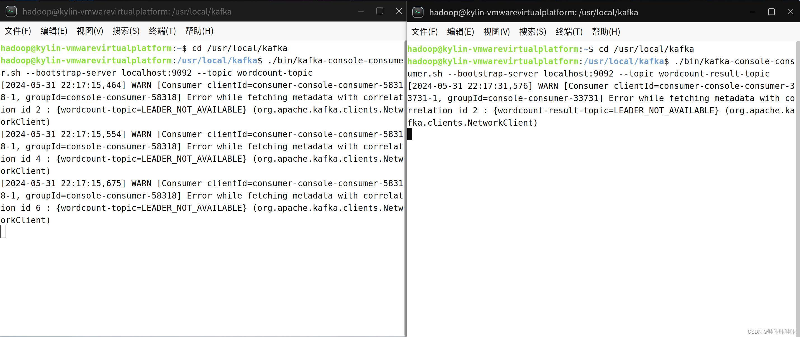

### （2）编写生产者（Producer）程序

在/home/hadoop/sparksj/mycode/structured/kafkasource目录下创建并编辑spark_ss_kafka_producer.py文件：

```bash
cd /home/hadoop/sparksj/mycode/structured/kafkasource
vim spark_ss_kafka_producer.py
```

```python
import string
import random
import time
from kafka import KafkaProducer

# 导入所需的库

if __name__ == "__main__":
    # 程序的入口点

    # 创建一个 Kafka 生产者，指定 Kafka 服务器的地址
    producer = KafkaProducer(bootstrap_servers=['localhost:9092'])

    while True:
        # 进入无限循环，不断生成并发送消息

        # 生成两个随机小写字母组成的字符串
        s2 = (random.choice(string.ascii_lowercase) for _ in range(2))
        word = ''.join(s2)

        # 将字符串转换为字节数组
        value = bytearray(word, 'utf-8')

        # 发送消息到名为 'wordcount-topic' 的 Kafka 主题
        # 并设置超时时间为 10 秒
        producer.send('wordcount-topic', value=value).get(timeout=10)

        # 休眠 0.1 秒，然后继续循环
        time.sleep(0.1)
```

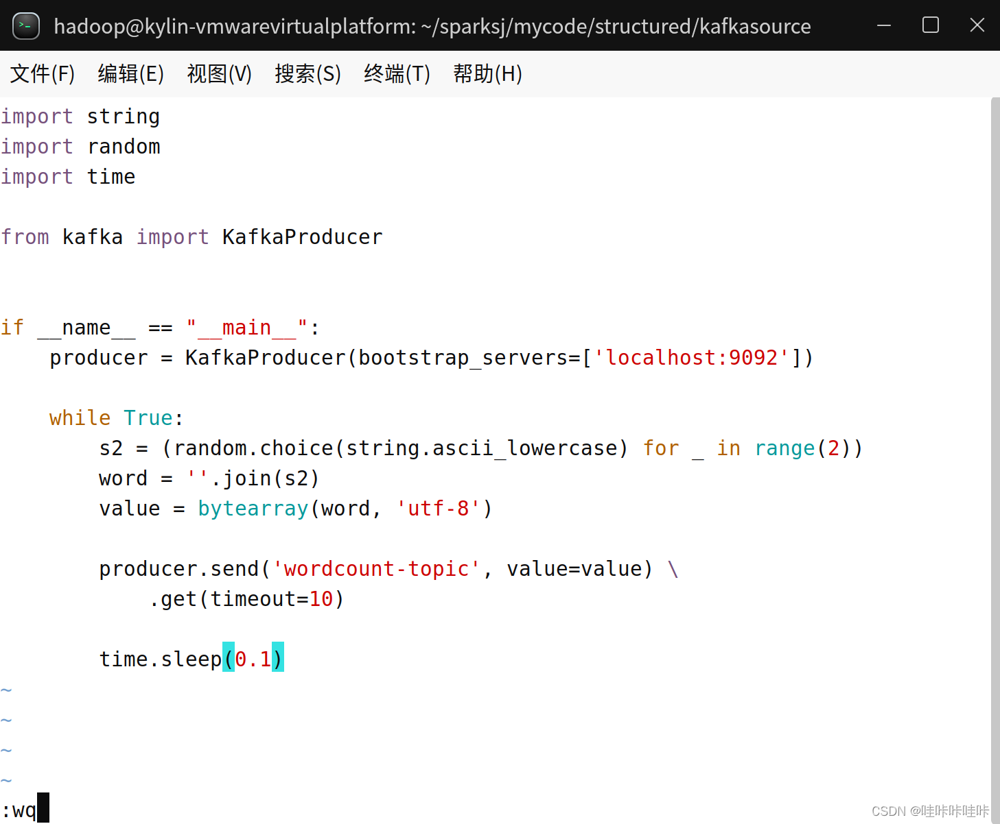

### （3）安装Python3的Kafka支持

在运行生产者程序之前要先安装[kafka-python](https://kafka-python.readthedocs.io/en/master/install.html)，如果读者之前<font color=red>已经安装可跳过此小节</font>。

1.首先确认有没有安装pip3，如果没有，使用如下命令安装（笔者已经安装，不在演示）：

```bash
sudo apt-get install pip3
```

2.安装kafka-python模块，命令如下：

```bash
sudo pip3 install kafka-python
```

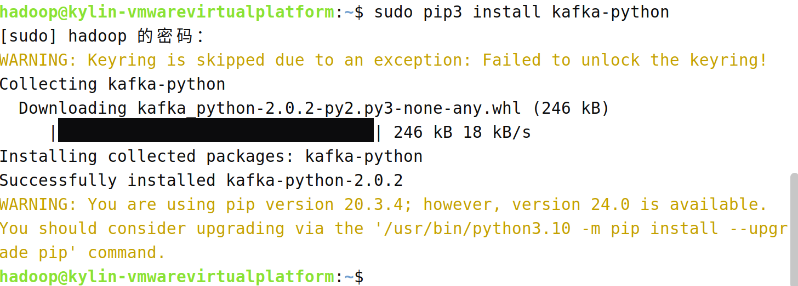

安装完成后可以使用'<font color=red>pip3 list</font>'命令列出当前 Python 环境中已安装的所有 Python 包，查看是否有kafka-python包：

```bash
pip3 list
```

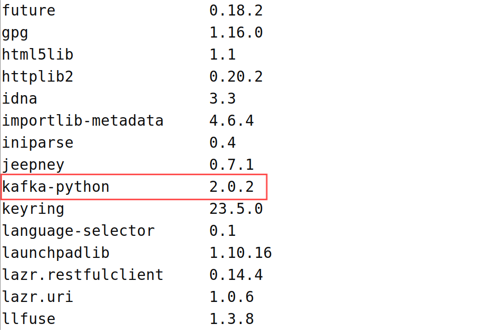

可以看到存在kafka-python包，版本为2.0.2

### （4）运行生产者程序

新建一个终端，在终端中执行如下命令运行生产者程序：

```bash
cd /home/hadoop/sparksj/mycode/structured/kafkasource
python3 spark_ss_kafka_producer.py
```

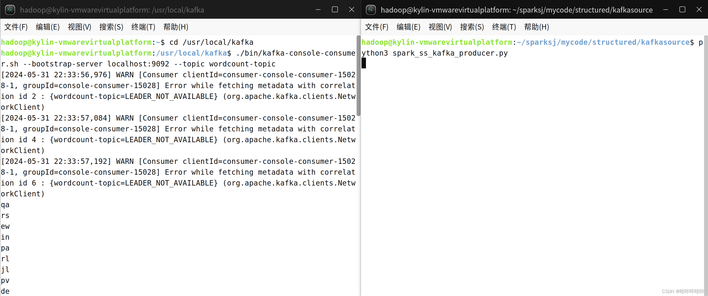

生产者程序执行以后，在“<font color=red>**监控输入终端**</font>”的窗口内就可以看到持续输出包含2个字母的单词。程序会生成随机字符串并将其发送到 Kafka 主题中，主题接收到随机字符串后会展示到终端。

**解释：**

执行（1）中的命令 `./bin/kafka-console-consumer.sh --bootstrap-server localhost:9092 --topic wordcount-topic` 会启动 Kafka 的控制台消费者，用于从指定的 Kafka 主题中读取消息并将其输出到控制台上。

而生产者程序是一个简单的 Kafka 生产者示例，用于生成随机字符串并将其发送到名为 'wordcount-topic' 的 Kafka 主题中。

当启动 Kafka 的控制台消费者同时运行生产者程序时，生产者代码会不断地生成随机字符串并发送到 'wordcount-topic' 主题，而控制台消费者则会从该主题中读取并显示这些消息。因此，会导致生产者不断地生成消息，并且控制台消费者会即时地输出这些消息，从而实现了消息的生产和消费过程。

上述用于测试 Kafka 环境的搭建和消息传递的过程，以确保生产者能够成功地将消息发送到指定的主题，同时消费者能够从该主题中接收并处理这些消息。

### （5）编写并运行消费者（Consumer）程序

同样，在/home/hadoop/sparksj/mycode/structured/kafkasource目录下创建并编辑spark_ss_kafka_consumer.py文件：

```bash
cd /home/hadoop/sparksj/mycode/structured/kafkasource
vim spark_ss_kafka_consumer.py
```

```python
from pyspark.sql import SparkSession

# 主程序入口
if __name__ == "__main__":
    # 创建一个 SparkSession
    spark = SparkSession \
        .builder \
        .appName("StructuredKafkaWordCount") \  # 设置应用程序名称
        .getOrCreate()  # 获取或创建 SparkSession 实例

    # 设置日志级别为WARN，避免过多的输出信息
    spark.sparkContext.setLogLevel('WARN')

    # 从 Kafka 主题中读取数据
    lines = spark \
        .readStream \  # 创建一个流式DataFrame
        .format("kafka") \  # 指定数据源格式为Kafka
        .option("kafka.bootstrap.servers", "localhost:9092") \  # 设置Kafka集群的地址
        .option("subscribe", 'wordcount-topic') \  # 订阅名为'wordcount-topic'的主题
        .load() \  # 从Kafka主题中加载数据
        .selectExpr("CAST(value AS STRING)")  # 将消息内容转换为字符串格式

    # 对数据进行聚合统计
    wordCounts = lines.groupBy("value").count()

    # 将结果写入到另一个 Kafka 主题中
    query = wordCounts \
        .selectExpr("CAST(value AS STRING) as key", "CONCAT(CAST(value AS STRING), ':', CAST(count AS STRING)) as value") \  # 格式化输出的key和value
        .writeStream \  # 创建一个流式DataFrame
        .outputMode("complete") \  # 定义输出模式为complete
        .format("kafka") \  # 指定输出数据源格式为Kafka
        .option("kafka.bootstrap.servers", "localhost:9092") \  # 设置Kafka集群的地址
        .option("topic", "wordcount-result-topic") \  # 指定输出的Kafka主题
        .option("checkpointLocation", "file:///tmp/kafka-sink-cp") \  # 设置检查点目录
        .trigger(processingTime="8 seconds") \  # 定时触发，每8秒处理一次数据
        .start()  # 启动流式查询

    query.awaitTermination()  # 等待流式查询终止
```

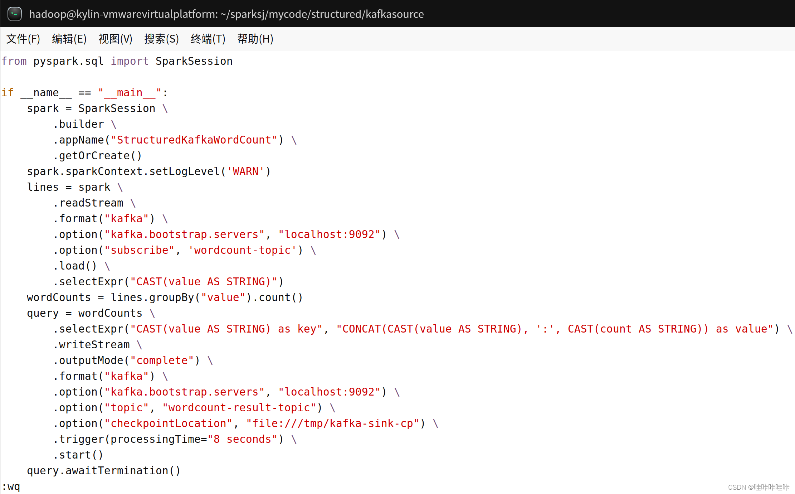

在运行消费者程序（即spark_ss_kafka_consumer.py）时，请<font color=red>确保kafka成功启动，监控输入终端与监控输出端成功启动，生产者程序成功启动</font>（若采用方式一启动消费者程序则可以等会生产者程序，因为jar包下载可能时间过长，长时间生产者程序会产生大量的数据；若采用方式二启动消费者程序则确保启动消费者程序前启动生产者程序，正如下方视频所示）

运行消费者程序可以有<font color=red>两种</font>方式：

#### 方式一

```bash
spark-submit --packages org.apache.spark:spark-sql-kafka-0-10_2.12:3.2.0 spark_ss_kafka_consumer.py
```

使用了`--packages`参数，指定了要从[Maven仓库](https://mvnrepository.com/)中下载并包含的依赖包，其中`org.apache.spark:spark-sql-kafka-0-10_2.12:3.2.0`是要添加的Kafka相关依赖。

作用：在运行应用程序时动态下载Kafka相关的依赖包，并将其添加到类路径中，以便应用程序能够访问这些依赖

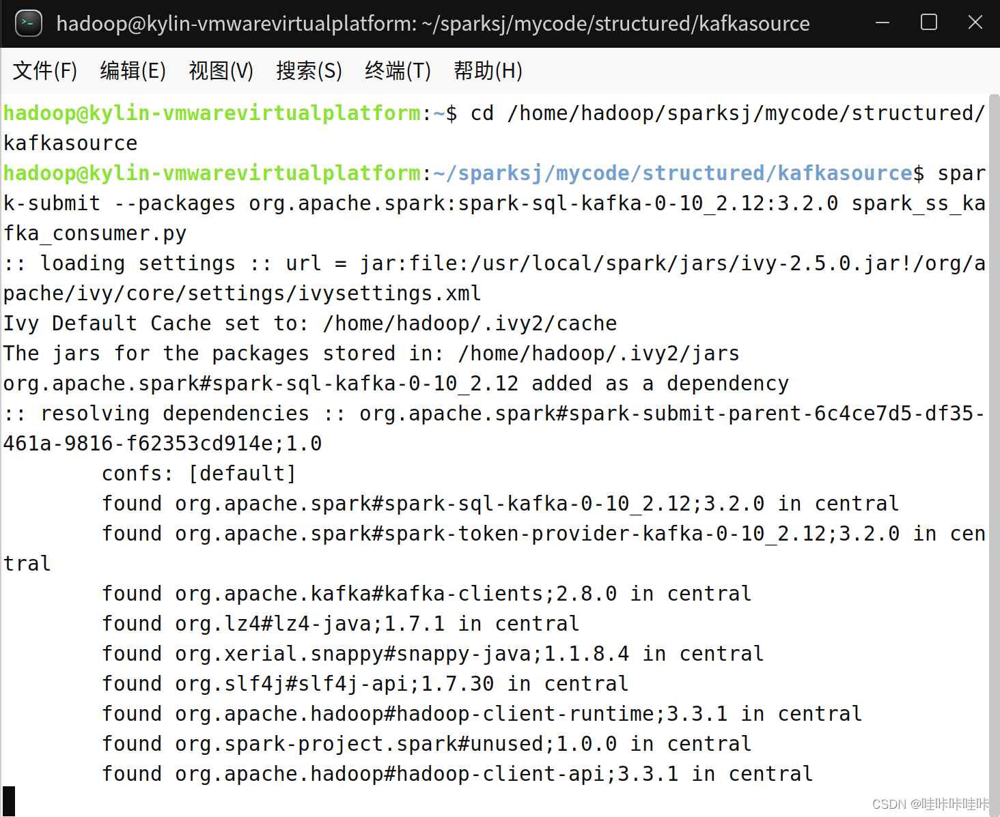

运行后会解析包依赖并从[Maven中心仓库](https://repo1.maven.org/maven2/)下载所需的JAR包，下载完成后进行运行，但这种方法依赖于自身网络环境，笔者这边因为是校园网，贼慢，故不再展示运行结果

#### 方式二

在执行下列代码之前，需要下载spark-sql-kafka-0-10_2.12-3.2.0.jar、kafka-clients-2.6.0.jar、commons-pool2-2.9.0.jar和spark-token-provider-kafka-0-10_2.12-3.2.0.jar文件（笔者spark版本为spark 3.2.0、kafka版本为kafka_2.12-2.6.0，读者请根据自己的版本调整jar版本的下载），将其**<font color=red>放到“/usr/local/spark/jars”目录下</font>**，现附上下载地址:

[spark-sql-kafka-0-10_2.12-3.2.0.jar文件下载页面](https://mvnrepository.com/artifact/org.apache.spark/spark-sql-kafka-0-10_2.12/3.2.0)
[kafka-clients-2.6.0.jar文件下载页面](https://mvnrepository.com/artifact/org.apache.kafka/kafka-clients/2.6.0)
[commons-pool2-2.9.0.jar文件下载页面](https://mvnrepository.com/artifact/org.apache.commons/commons-pool2/2.9.0)
[spark-token-provider-kafka-0-10_2.12-3.2.0.jar文件下载页面](https://mvnrepository.com/artifact/org.apache.spark/spark-token-provider-kafka-0-10_2.12/3.2.0)


若上述网站不能打开，可尝试电脑连接手机热点或使用如下网址进行下载：

链接：https://pan.baidu.com/s/121zVsgc4muSt9rgCWnJZmw 
提取码：wkk6

[spark-sql-kafka-0-10_2.12-3.2.0.jar文件下载页面](https://repo1.maven.org/maven2/org/apache/spark/spark-sql-kafka-0-10_2.12/3.2.0/)

[kafka-clients-2.6.0.jar文件下载页面](https://repo1.maven.org/maven2/org/apache/kafka/kafka-clients/2.6.0/)

[commons-pool2-2.9.0.jar文件下载页面](https://repo1.maven.org/maven2/org/apache/commons/commons-pool2/2.9.0/)

[spark-token-provider-kafka-0-10_2.12-3.2.0.jar文件下载页面](https://repo1.maven.org/maven2/org/apache/spark/spark-token-provider-kafka-0-10_2.12/3.2.0/)


下列两段代码二选一执行：

```bash
spark-submit --jars "/usr/local/spark/jars/*" spark_ss_kafka_consumer.py
```

或

```bash
spark-submit --jars "/usr/local/kafka/libs/*:/usr/local/spark/jars/*" spark_ss_kafka_consumer.py
```

使用了`--jars`参数，指定了要包含在类路径中的外部JAR包的路径

`/usr/local/kafka/libs/*`和`/usr/local/spark/jars/*`是要包含的Kafka和Spark相关的JAR包的路径

作用：显式地指定要包含在类路径中的JAR包，而不是动态下载依赖


运行如下所示（同样可以设置输出日志级别来控制日志的输出，在此不再赘述）：

视频版：

<video src="./../images/2024-06-01-【笔记】Sturctured Streaming笔记总结（Python版）/structuredstreaming-kafka.mp4"></video>

structured streaming使用kafka源

GIF版：

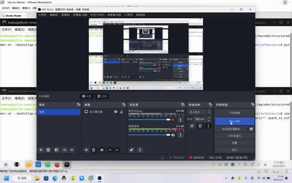

嘿嘿嘿，博主<font color=red>贴心</font>的准备了视频和动图两个版本，读者可按需自取😎

就麻烦各位点个赞啦~~(*/ω＼*)

### 总结

1. `./bin/kafka-console-consumer.sh --bootstrap-server localhost:9092 --topic wordcount-topic：`在终端监控名为`wordcount-topic`的Kafka主题的输入信息
2. `./bin/kafka-console-consumer.sh --bootstrap-server localhost:9092 --topic wordcount-result-topic` ：在终端监控名为`wordcount-result-topic`的Kafka主题的输出信息
3. `spark_ss_kafka_producer.py` ：生成随机的两个小写字母字符串，并将其发送到`wordcount-topic`主题中
4. `spark_ss_kafka_consumer.py` ：从`wordcount-topic`主题中读取消息，对单词进行计数，然后将结果写入`wordcount-result-topic`主题。该程序会持续运行并等待新的输入消息

如果依次执行了上述四个命令或代码，可以得到以下结果：

- 监控输入终端会显示从`wordcount-topic`主题中接收到的随机小写字母字符串
- 监控输入终端会显示从`wordcount-result-topic`主题中接收到的单词计数结果
- 生产者程序会不断地生成随机字符串，并将其发送到`wordcount-topic`主题
- 消费者程序会持续地从`wordcount-topic`主题中读取消息，对单词进行计数，并将结果写入`wordcount-result-topic`主题

如果只执行第一条命令和生产者程序，那么会看到终端不断打印出随机的两个小写字母字符串，而不会有单词计数或结果输出。

## 3.3 Socket源

Socket 源的选项（option）包括如下几个：

- host：主机 IP地址或者域名，必须设置。
- port：端口号，必须设置。
- includeTimestamp：是否在数据行内包含时间戳。使用时间戳可以用来测试基于时间聚合的功能。


Socket源从一个本地或远程主机的某个端口服务上读取数据，数据的编码为UTF8。因为Socket源使用内存保存读取到的所有数据，并且远端服务不能保证数据在出错后可以使用检查点或者指定当前已处理的偏移量来重放数据，所以，它无法提供端到端的容错保障。Socket源一般<font color=gree>仅用于测试或学习用途</font>。

实例可参考[二、编写Structured Streaming程序的基本步骤](#二、编写Structured Streaming程序的基本步骤)

## 3.4 Rate源

Rate源是一种用于生成模拟数据流的内置数据源。

Rate源可每秒生成特定个数的数据行，每个数据行包括时间戳和值字段。时间戳是消息发送的时间，值是从开始到当前消息发送的总个数，从0开始。Rate源一般用来作为调试或性能基准测试。

Rate 源的选项（option）包括如下几个：

- rowsPerSecond：每秒产生多少行数据，默认为1。
- rampUpTime：生成速度达到rowsPerSecond 需要多少启动时间，使用比秒更精细的粒度将会被截断为整数秒，默认为0秒。
- numPartitions：使用的分区数，默认为Spark的默认分区数。

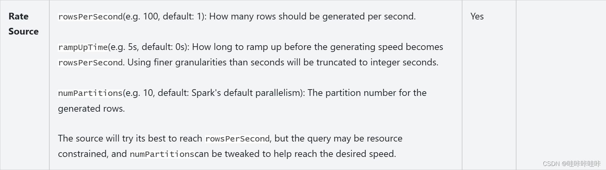

Rate 源会尽可能地使每秒生成的数据量达到rowsPerSecond，可以通过调整numPartitions以尽快达到所需的速度。这几个参数的作用类似一辆汽车从0加速到100千米/小时并以100千米/小时进行巡航的过程，通过增加“马力”（numPartitions），可以使得加速时间（rampUpTime）更短。
 可以用一小段代码来观察 Rate 源的数据行格式和生成数据的内容。

可以用以下代码来观察Rate源的数据行格式和生成数据的内容：

在/home/hadoop/sparksj/mycode/structured/ratesource目录下新建文件spark_ss_rate.py：

```python
from pyspark.sql import SparkSession

if __name__ == "__main__":
    # 创建一个 SparkSession 对象
    spark = SparkSession \
        .builder \
        .appName("TestRateStreamSource") \
        .getOrCreate()

    # 设置日志级别为WARN
    spark.sparkContext.setLogLevel('WARN')

    # 从 Rate source 中读取数据流
    lines = spark \
        .readStream \
        .format("rate") \
        .option('rowsPerSecond', 5) \
        .load()
    
    # 打印出数据流的 schema
    print(lines.schema)

    # 将数据流写入控制台
    query = lines \
        .writeStream \
        .outputMode("update") \
        .format("console") \
        .option('truncate', 'false') \
        .start()

    # 等待流处理的终止
    query.awaitTermination()
```

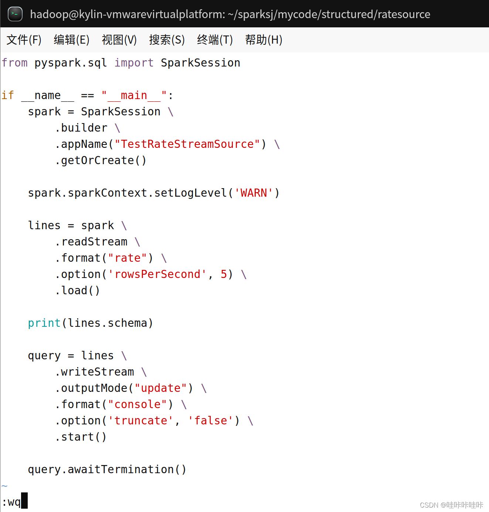

在Linux终端执行spark_ss_rate.py：

```bash
cd /home/hadoop/sparksj/mycode/structured/ratesource
spark-submit spark_ss_rate.py
```

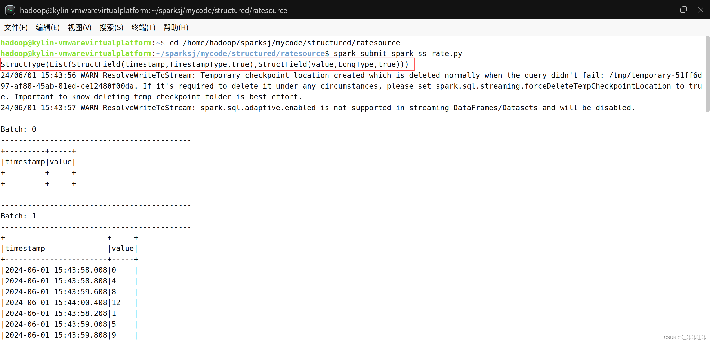

输出的第一行（即上图红框框住的那一行）StruckType就是print(lines.schema)输出的数据行的格式。

当运行这段代码时，它会生成模拟的连续数据流，并将其写入控制台进行显示。输出结果会包含时间戳和生成的值。同时，程序会持续运行，直到手动终止或出现异常。

------

同[（4）处理警告](#（4）处理警告)，也可以设置日志输出等级来忽略警告，将spark.sparkContext.setLogLevel('WARN')改为spark.sparkContext.setLogLevel('ERROR')：


再次执行结果如下，干净整洁~~(❁´◡`❁)~~☆*: .｡. o(≧▽≦)o .｡.:*☆

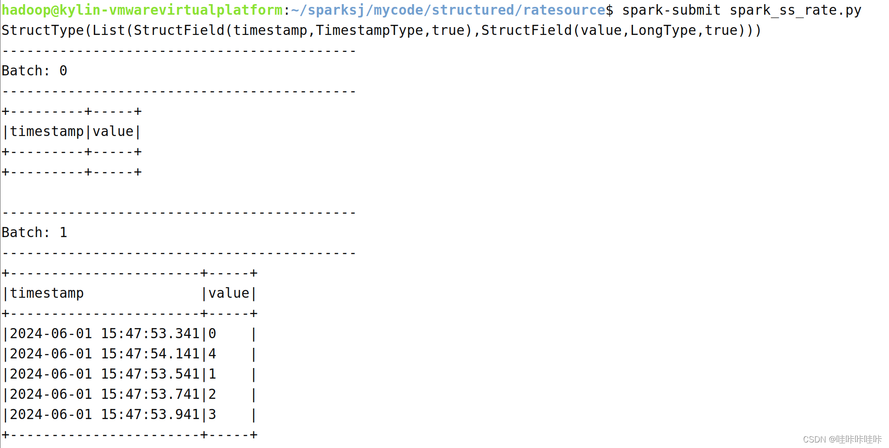

